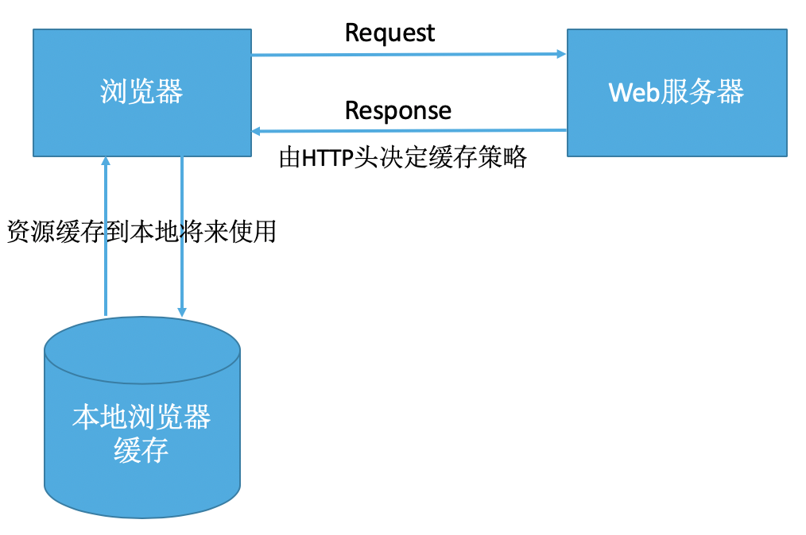
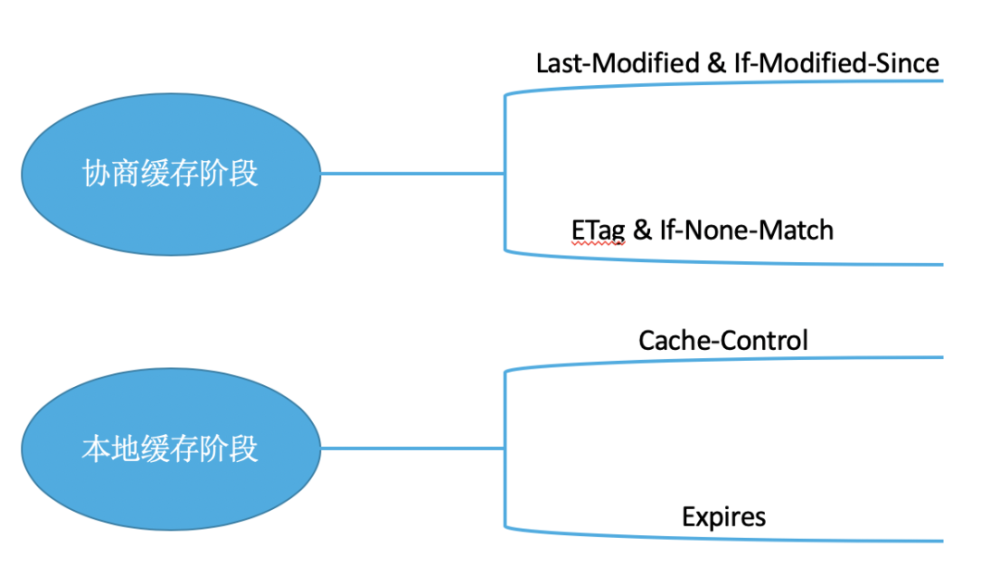
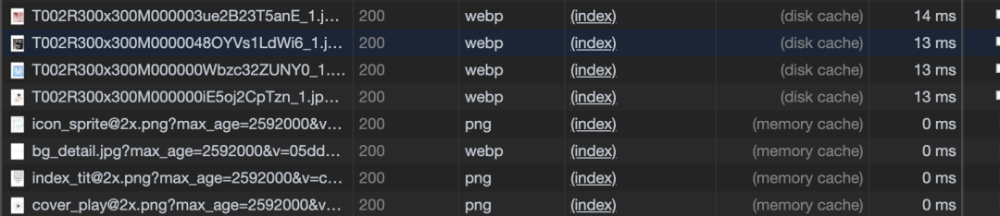
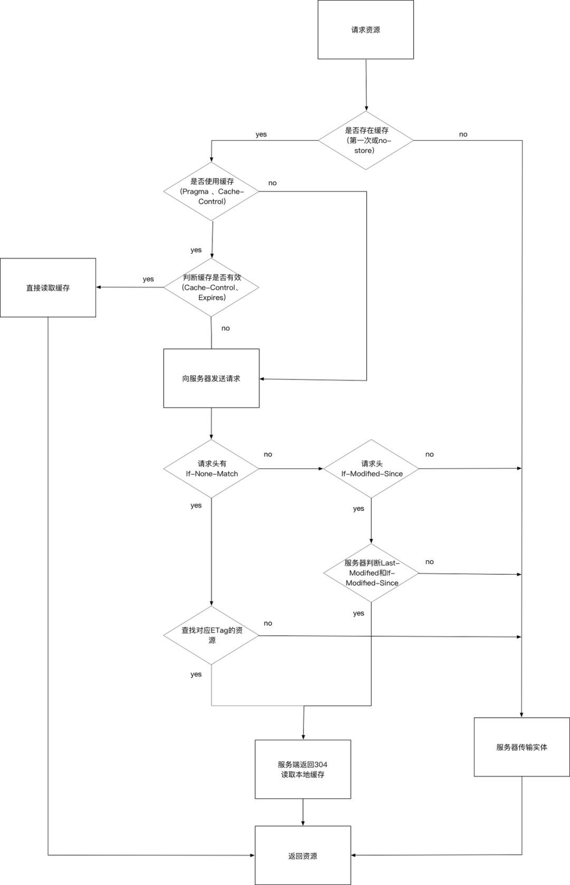
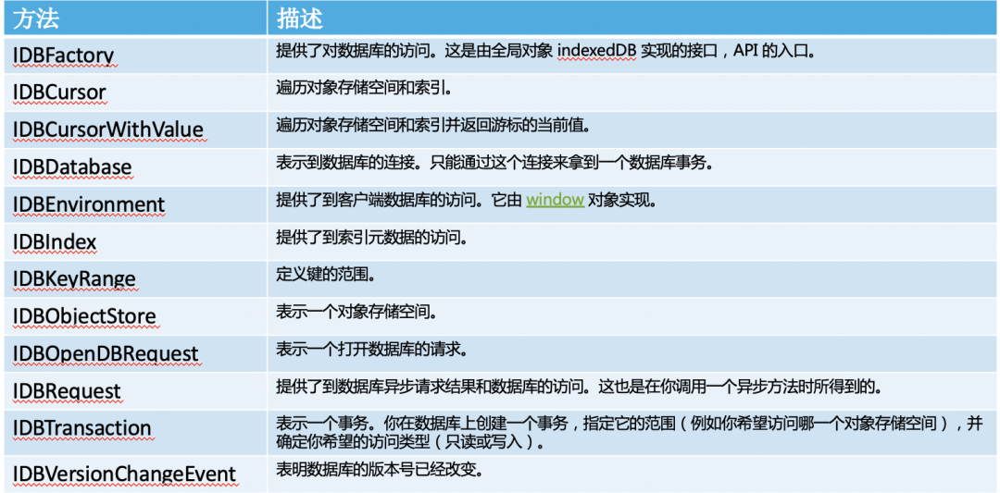

# 彻底弄懂浏览器缓存策略

> 浏览器缓存策略对于前端开发同学来说不陌生，大家都有一定的了解，但如果没有系统的归纳总结，可能三言两语很难说明白，甚至说错，尤其在面试过程中感触颇深，很多候选人对这类基础知识竟然都是一知半解，说出几个概念就没了，所以重新归纳总结下，温故而知新。

## Web 缓存介绍

- Web 缓存是指一个 Web 资源（如 HTML 页面，图片，JavaScript，数据等）存在于 Web 服务器和客户端（浏览器）之间的副本。
- 缓存会根据进来的请求保存输出内容的副本；当下一个请求来到的时候，如果是相同的 URL，缓存会根据缓存机制决定是直接使用副本响应访问请求，还是向源服务器再次发送请求。

## Web 缓存的好处

- 减少网络延迟，加快页面打开速度
- 减少网络带宽消耗
- 降低服务器压力
- ……

## HTTP 的缓存机制

简化的流程如下


根据什么规则缓存

1. 新鲜度（过期机制）：也就是缓存副本有效期。一个缓存副本必须满足以下条件，浏览器认为它是有效的，足够新的。
   - 含有完整的过期时间控制头信息（HTTP 协议报头），并且仍在有效期内；
   - 浏览器已经使用过这个缓存副本，并且在一个绘画中已经检查过新鲜度。
2. 校验值（验证机制）：服务器返回资源的时候在控制头信息带上这个资源的实体标签 ETag（Entity Tag），它可以用来作为浏览器再次请求过程的校验标识。如果发现校验标识不匹配，说明资源已经被修改或过期，浏览器需要重新获取资源内容。

## HTTP 缓存的两个阶段

浏览器缓存一般分为两类：强缓存（也称为本地缓存）和协商缓存（也称为弱缓存）。

**本地缓存阶段**

浏览器发送请求前，会先去缓存里查看是否命中强缓存，如果命中，则直接从缓存中读取资源，不会发送请求到服务器。否则，进入下一步。

**协商缓存阶段**

当强缓存没有命中时，浏览器一定会想服务器发起请求。服务器会根据 Request Header 中的一些字段来判断是否命中协商缓存。如果命中，服务器会返回 304 响应，但是不会携带任何响应实体，只是告诉浏览器可以直接从浏览器缓存中获取这个资源。如果本地缓存和协商缓存都没有命中，则直接从服务器加载资源。

**启用 & 关闭缓存**

按照本地缓存阶段和协商缓存阶段分类：



1. 使用 HTTP Meta 标签，Web 开发者可以在 HTML 页面的节点中加入标签，如下：

    ```html
    <meta http-equiv="Cache-Control" content="no-cache, no-store, must-revalidate"/>
    <meta http-equiv="Pragma" content="no-cache"/>
    <meta http-equiv="Expires" content="0" />
    ```

    上述代码的作用是告诉浏览器当前页面不被缓存，事实上这种禁用缓存的形式用处很有限：

      1. 仅有 IE 才能识别该 `meta` 标签含义，其他主流浏览器仅识别 `“Cache-Control: no-store”` 的 `meta` 标签；
      2. 在 IE 中识别到该 `meta` 标签含义，并不一定会在请求字段加上 Pragma，但的确会让当前页面每次都发送新请求（仅限页面，页面上的资源不受影响）。

2. 使用缓存有关的 HTTP 消息报头，这里需要了解 HTTP 的基础知识。一个 URL 的完整 HTTP 协议交互过程是由 HTTP 请求和 HTTP 响应组成的。有关 HTTP 详细内容可参考 《Hypertext Transfer Protocol — HTTP/1.1》、《HTTP 权威指南》等。

  在 HTTP 请求和响应的消息报头中，常见的与缓存相关的消息报头有：

  | 规则   | 消息报头            | 值 / 示例                                  | 类型 | 作用                                                                                                  |
  | ------ | ------------------- | ------------------------------------------ | ---- | ----------------------------------------------------------------------------------------------------- |
  | 新鲜度 | `Expires`           | `Wed, 21 Oct 2015 07:28:00 GMT`            | 响应 | 告诉浏览器在过期时间前可以使用副本（有可能存在时间不一致的问题）                                      |
  |        | `Pragma`            | `no-cache`                                 | 响应 | 告诉浏览器忽略资源的缓存副本（HTTP 1.1 可用 `Cache-Control` 替代）                                    |
  |        | `Cache-Control`     | `no-cache`                                 | 响应 | 告诉浏览器忽略资源的缓存副本，强制每次请求直接发送给源服务器                                          |
  |        |                     | `no-store`                                 | 响应 | 强制缓存在任何情况下都不要保留任何副本                                                                |
  |        |                     | `max-age=seconds`                          | 响应 | 指明缓存副本的有效时长，从请求时间开始过期时间之间的秒数                                              |
  |        |                     | `public`                                   | 响应 | 任何途径的缓存者（本地缓存、代理服务器），可以无条件的缓存该资源                                      |
  |        |                     | `private`                                  | 响应 | 只针对单个用户或实体（不同用户，窗口）缓存资源                                                        |
  |        | `Last-Modified`     | `Wed, 21 Oct 2015 07:28:00 GMT`            | 响应 | 告诉浏览器当前资源的最后修改时间                                                                      |
  |        | `If-Modified-Since` | `Wed, 21 Oct 2015 07:28:00 GMT`            | 响应 | 如果浏览器第一次请求时响应中 `Last-Modified` 非空，第二次请求同一资源时，会把它作为该项的值发给服务器 |
  | 校验值 | `ETag`              | `33a64df551425fcc55e4d42a148795d9f25f89d4` | 响应 | 告诉浏览器当前资源在服务器的唯一标识符（生成规则由服务器决定）                                        |
  |        | `If-None-Match`     | `bfc13a64729c4290ef5b2c2730249c88ca92d82d` | 请求 | 如果浏览第一次请求时响应中 ETag 非空，第二次请求同一资源时，会把它作为该项的值发给服务器              |
  | 辅助   | `Vary`              | `Accept-Encoding`                          | 响应 | 辅助从多个缓存副本中筛选合适的版本（不同的压缩算法产生的副本）                                        |

上图中只是常用的消息报头，下面来看下不同字段之间的关系和区别：

- `Cache-Control` 与 `Expires`
  `Cache-Control`：HTTP 1.1 提示的特性，为了弥补 `Expires` 缺陷加入的，提供了更精确细致的缓存功能。详细了解看几个常用的指令：
  - `max-age=<seconds>` 功能和 `Expires` 类似，但是后面跟一个"秒"为单位的相对时间，来供浏览器计算过期时间。
  - `no-cache` 提供了过期验证机制
  在 Chrome 的 DevTools 中勾选 Disabled cache 选项，发送的请求会去掉 `If-Modified-Since` 这个的请求会去掉 `if-modified-since` 这个 Header。同时设置 `Cache-Control: no-cache Pragma: no-cache`，每次请求均为 `200`）
  - `no-store`：表示当前请求资源禁用缓存
  - `public`：表示缓存的版本可以被代理服务器或者其他中间服务器识别
  - `private`：表示只有用户自己的浏览器能够进行缓存，公共的代理服务器不允许缓存
- `Expires`：HTTP 1.0 的特性，标识该资源过期的时间点，它是一个绝对值。格林威治时间（Greenwich Mean Time, GMT），即在这个时间点之后，缓存的资源过期；优先级：`Cache-Control` 优先级高于 `Expire`，为了兼容，通常两个头部同时设置；浏览器默认行为：其实就算 Response Header 中没有设置 `Cache-Control` 和 `Expire`，浏览器仍然会缓存某些资源，这是浏览器的默认行为：其实就算 Response Header 中没有设置 `Cache-Control` 和 `Expires`，浏览器仍然会缓存某些资源，这是浏览器的默认行为，是为了提升性能进行的优化，没有浏览器的行为可能不一致，有些浏览器甚至没有这样的优化。

`Last-Modified` 与 `ETag`

- `Lat-Modified`(Response Header) 与 `If-Modified-Since`(Request Header) 是一对报文头，属于 HTTP 1.0

  `If-Modified-Since` 是一个请求首部字段，并且只能在 GET 或 HEAD 请求中。`Last-Modified` 是一个响应首部字段，包含服务器认定的资源作出修改的日期及时间。当带着 `If-Modified-Since` 头访问服务器请求资源时，服务器会检查 `Last-Modified`，如果 `Last-Modified` 的时间早于或等于 `If-Modified-Since` 则会返回一个不带响应体的 304 响应，否则将重新返回资源。

  

- `ETag` 与 `If-None-Match` 是一对报头文，属于 HTTP 1.1

  `ETag` 是一个响应首部字段，它是根据实体内容生成的一段 hash 字符串，标识资源的状态，由服务端产生。`If-None-Match` 是一个条件表达式的请求首部。如果请求资源时在请求首部加上这个字段，值为之前服务器返回的资源上的 `ETag`，且当前仅当服务器上没有任何资源的 `ETag` 属性值与这个首部中列出的时候，服务器才会返回带有所请求的 200 响应，否则服务器返回不带实体的 304 响应。

  

- `ETag` 能解决什么问题？

  - `Last-Modified` 标注的最后修改只能精确到秒级，如果某些文件在 1 秒中以内，被修改多次的话，它将不能准确的标注文件的新鲜度；
  - 某些文件的也许会周期性的更改，但是它的内容并不会改变（仅仅改变修改时间），但 `Last-Modified` 却改变了，导致文件没发使用缓存；
  - 有可能存在服务器没有准确获取文件修改时间，或者与代理服务器时间不一致等情形。

- 优先级：`ETag` 优先级比 `Last-Modified` 高，同时存在会以 `ETag` 为准。


## 缓存位置

浏览器可以在内存、硬盘中开辟一个空间用于保存请求资源副本。我们经常在 DevTools Network 里看到 Memory Cache (内存缓存) 和 Disk Cache (硬盘缓存)，指的就是缓存所在的位置。请求一个资源时，会按照优先级 (Service -> Memory Cache -> Disk Cache -> Push Cache ) 依次查询缓存，如果命中则使用缓存，否则发起请求。这里先介绍 Memory Cache 和 Disk Cache。

200 - from memory cache

表示不妨问服务器，直接从内存中读取缓存。因为缓存的资源保存在内存中，所以读取速度较快，但是关闭进程后，缓存资源也会随之销毁，一般来说，系统不会给内存较大的容量，因此内存缓存一般用于存储较小文件。同时内存缓存在有时效性的场景下也很有用（比如浏览器的隐私模式）。

200 - from disk cache

表示不妨问服务器，直接从硬盘中读取缓存。与内存相比，硬盘的读取速度相对较慢，但硬盘缓存的持续时间更长，关闭进程之后，缓存的资源仍然存在。由于硬盘的容量较大，因此一般用于存储大文件。

下图可清晰看出差别：



CDN Cache

以腾讯 CDN 为例：`X-Cache-Lookup: Hit From MemCache` 表示命中 CDN 节点的内存；`X-Cache-Lookup: Hit From Disktank` 表示命中 CND 节点的硬盘；`X-Cache-Lookup: Hit From Upstream` 表示没有命中 CDN。


整体流程



从上图能感受到整个流程，比如常见的两种刷新场景

- 当 F5 刷新网页时，跳过强缓存，但是会检查协商缓存；
- 当 Ctrl + F5 强制刷新页面时，直接从服务器加载，跳过强缓存和协商缓存；

## 其他 Web 缓存策略

### `IndexDB`

`IndexDB` 就是浏览器提供的本地数据库，能够在客户端存储数量可观的结构化数据，并且在这些数据上使用索引进行高性能检索的 API。

异步 API 方法调用后会立即返回，而不会阻塞调用线程。要异步访问数据库，要调用 `window` 对象 `IndexedDB` 属性的 `open` 方法。该方法返回一个 `IDBRequest` 对象（`IDBOpenDBRequest`）；异步操作通过在 `IDBRequest` 对象上触发事件来和调用程序进行通信。

常用异步 API 如下



### `Service Worker`

`ServiceWorker` 从 2014 年提出的草案到现在已经发展很成熟了，基于 `Service Worker` 做离线缓存，让用户能够进行离线体验，消息推送体验，离线缓存能力涉及到 `Cache` 和 `CacheStorage` 的概念，篇幅有限，不展开了。

### `LocalStorage`

`localStorage` 属性允许你访问一个 `Document` 源 (`origin`) 的对象 `Storage` 用于存储当前源的数据，除非用户人为清除 (调用 `localStorage` api 或则清除浏览器数据)， 否则存储在 `localStorage` 的数据将被长期保留。

### `SessionStorage`

`SessionStorage` 属性允许你访问一个 `SessionStorage` 对象，用于存储当前会话的数据，存储在 `SessionStorage` 里面的数据在页面会话结束时会被清除。页面会话在浏览器打开期间一直保持，并且重新加载或恢复页面仍会保持原来的页面会话。

## 定义最优缓存策略

- 使用一致的网址：如果您在不同的网址上提供相同的内容，将会多次获取和存储该内容。注意：URL 区分大小写！
- 确定中继缓存可以缓存哪些资源：对所有用户的响应完全相同的资源很适合由 CDN 或其他中继缓存进行缓存；
- 确定每个资源的最优缓存周期：不同的资源可能有不同的更新要求。审查并确定每个资源适合的 `max-age`；
- 确定网站的最佳缓存层级：对 HTML 文档组合使用包含内容特征码的资源网址以及短时间或 `no-cache` 的生命周期，可以控制客户端获取更新的速度；
- 更新最小化：有些资源的更新比其他资源频繁。如果资源的特定部分（例如 JS 函数或一组 CSS 样式）会经常更新，应考虑将其代码作为单独的文件提供。这样，每次获取更新时，剩余内容（例如不会频繁更新的库代码）可以从缓存中获取，确保下载的内容量最少；
- 确保服务器配置或移除 `ETag`：因为 `Etag` 跟服务器配置有关，每台服务器的 `Etag` 都是不同的；
- 善用 HTML5 的缓存机制：合理设计启用 `LocalStorage`、`SessionStorage`、`IndexDB`、`ServiceWorker` 等存储，会给页面性能带来明显提升；
- 结合 Native 的强大存储能力：善于利用客户端能力，定制合适的缓存机制，打造极致体验。
